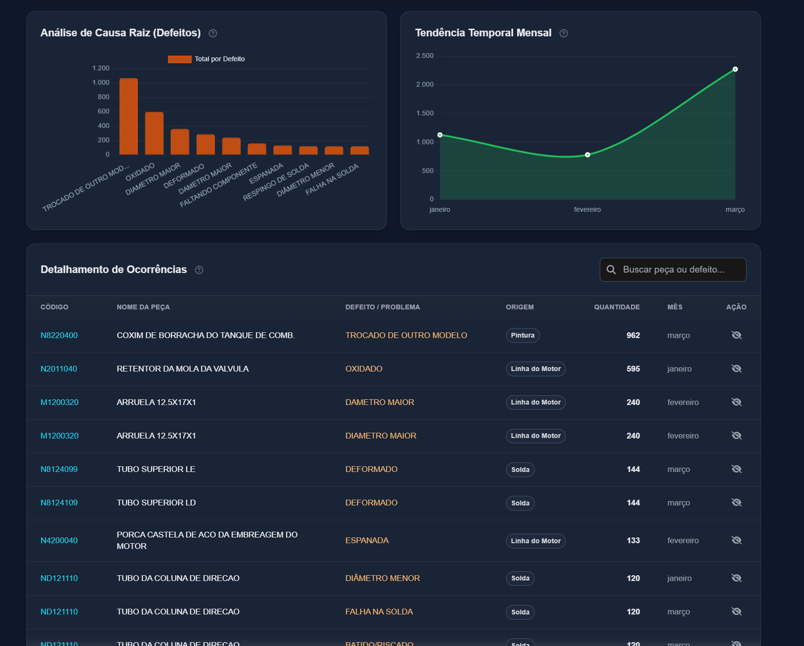
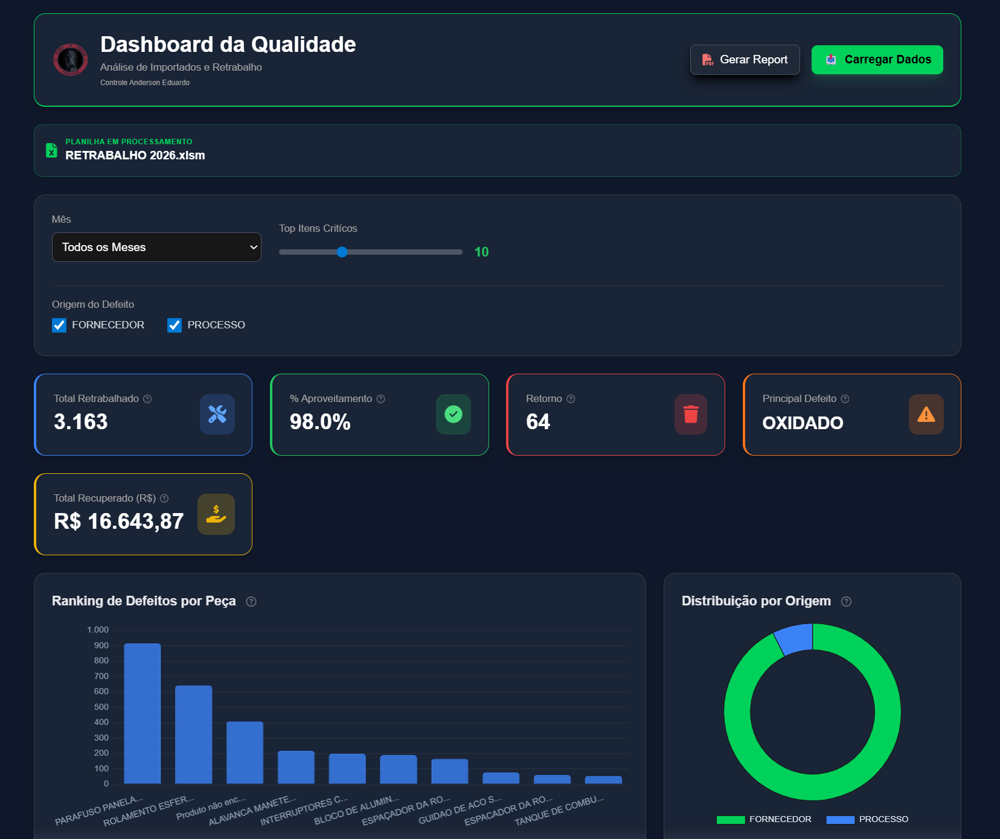
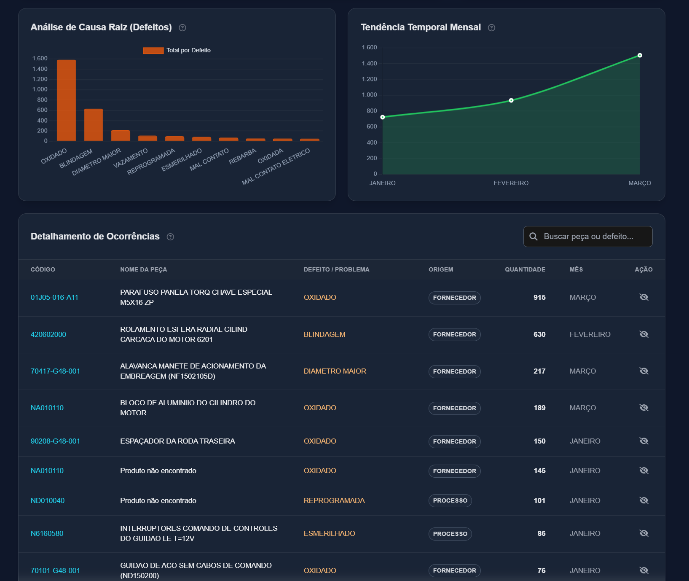
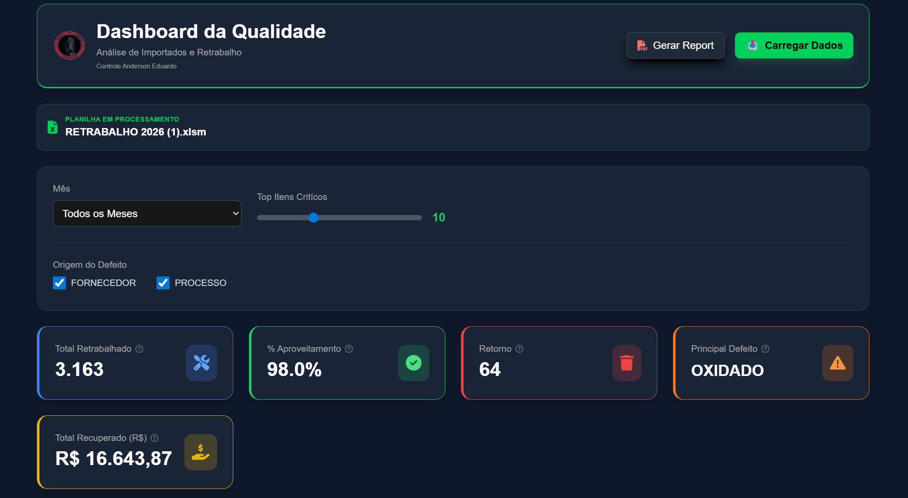
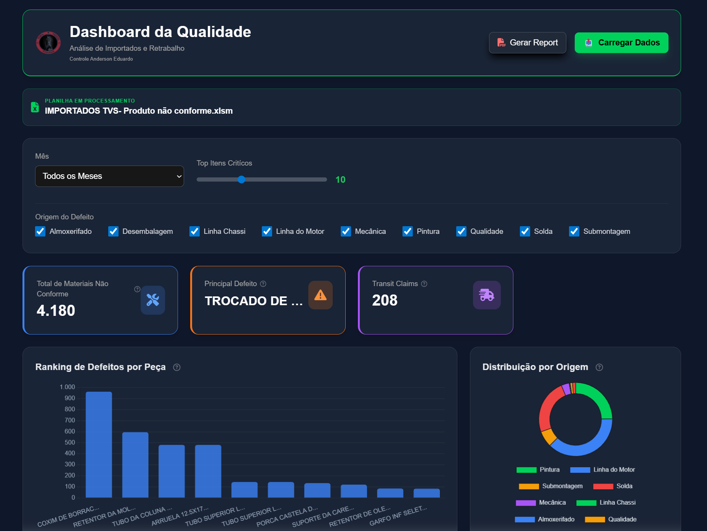

📊 Dashboard de Retrabalho e Importação

Este projeto consiste em um dashboard dinâmico desenvolvido para automatizar a análise de dados de retrabalho, substituindo um processo manual realizado em Excel.

A solução foi criada com foco em performance, simplicidade e impacto real no negócio, permitindo que dados sejam processados rapidamente e apresentados de forma visual e estratégica.

🚀 Funcionalidades

📥 Importação rápida de dados

📊 Geração automática de gráficos

📄 Exportação de relatórios em PDF

💰 Cálculo do valor financeiro recuperado (R$)

🧹 Interface limpa e intuitiva

⚡ Processamento rápido e eficiente

💡 Problema Resolvido

Antes deste projeto, o processo de análise era:

Manual

Demorado

Suscetível a erros

Com o dashboard:

O tempo de execução foi reduzido drasticamente

Os dados passaram a ser mais confiáveis

As informações ficaram prontas para reuniões estratégicas

🛠️ Tecnologias Utilizadas

HTML5

CSS3

JavaScript (Vanilla)

📸 Demonstração
📊 Dashboard em funcionamento

  
 
  
 
  
 
  
 
  
 
  

▶️ Como Executar
git clone https://github.com/seu-usuario/seu-repositorio.git
cd seu-repositorio

Abra o arquivo index.html no navegador.

📈 Impacto do Projeto

⏱️ Redução de horas de trabalho manual

📊 Melhor visualização dos dados

💼 Uso real em reuniões da empresa

💡 Apoio à tomada de decisão

🔮 Melhorias Futuras

Cálculo de ROI (Retorno sobre investimento)

Integração com banco de dados

Upload automatizado de planilhas

Filtros avançados de análise

👩‍💻 Autora

Sabrina Caldas
💼 Estagiária de Desenvolvimento de Sistemas
🚀 Focada em automação e soluções práticas com tecnologia
